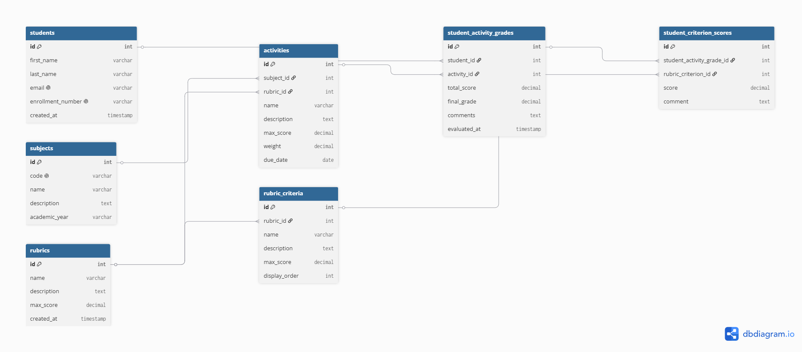
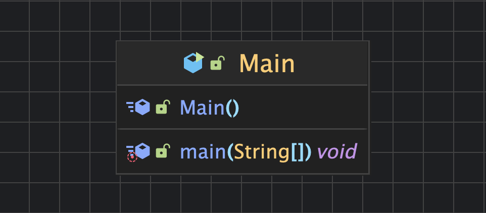
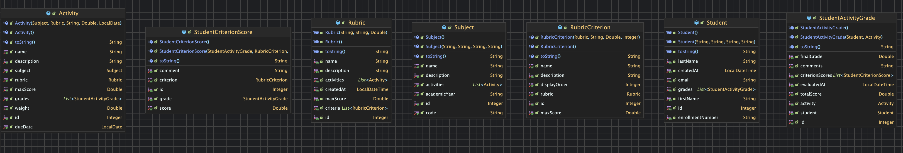
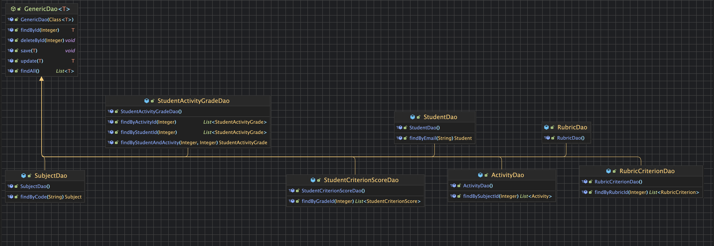
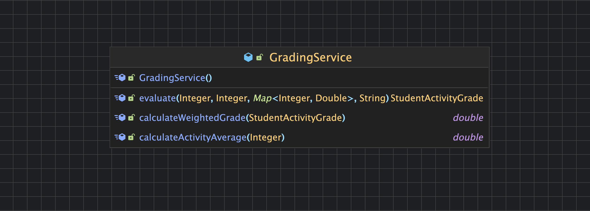
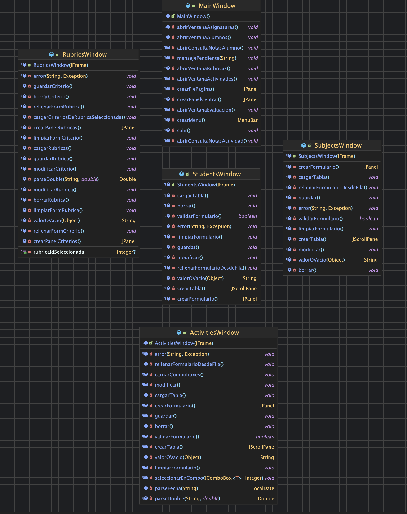
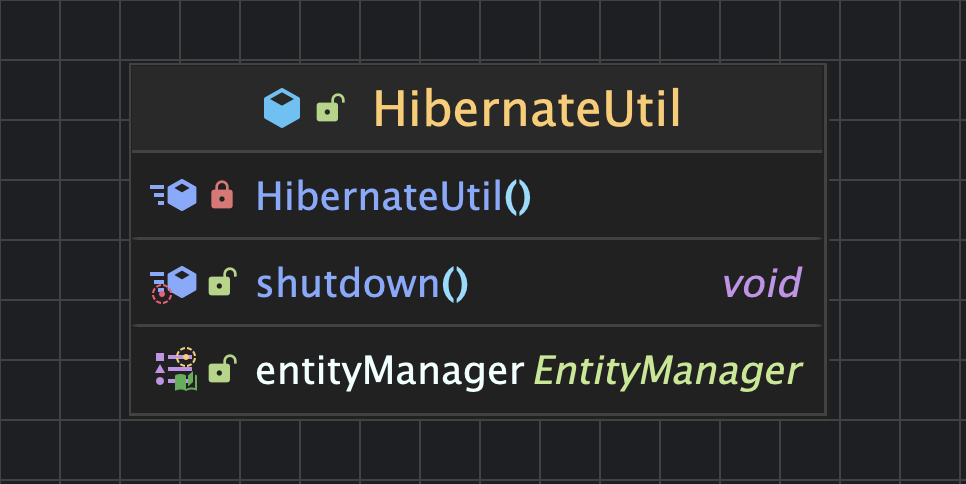

# RubriGrade

**Verificador de Rúbricas y Notas**

Aplicación de escritorio Java pensada para el profesorado, permite evaluar
actividades mediante rúbricas, calcular automáticamente la nota final de cada
alumno y mantener un historial consultable de calificaciones.

> Proyecto Final de UT8 · 1.º DAW · IES El Rincón · Curso 2025/26 realizado por Iván Brito Perez y Juan Pablo Miguel Velasquez

---

## Características principales

-  **Gestión completa** de alumnos, asignaturas, actividades, rúbricas y criterios (CRUD).
-  **Evaluación por rúbrica**: seleccionas actividad y alumno, introduces la puntuación de cada criterio y la app calcula la nota final.
-  **Cálculo automático** de la nota total y conversión a escala 0-10.
- ️ **Validaciones de negocio**: no se permiten puntuaciones negativas ni superiores al máximo definido por criterio.
-  **Re-evaluación**: si un alumno ya estaba evaluado, sus notas se cargan automáticamente para poder corregirlas.
-  **Consultas** de notas por alumno y por actividad (con media y listado de pendientes).
-  **Persistencia con Hibernate** sobre MySQL.

---

##  Tecnologías

| Capa | Tecnología |
|---|---|
| Lenguaje | Java 21 |
| Persistencia (ORM) | Hibernate 6.6 (Jakarta Persistence 3.0) |
| Base de datos | MySQL |
| Interfaz gráfica | Java Swing |
| Gestión de proyecto | Maven |
| Control de versiones | Git + GitHub |
| IDE | IntelliJ IDEA |

---

##  Requisitos previos

- **JDK 21** o superior instalado.
- **MySQL Server 8** (o MariaDB equivalente) corriendo en `localhost:3306`.
- **Maven 3.8+** (IntelliJ lo trae embebido).
- **Git** para clonar el repositorio.

---

## Puesta en marcha

### 1. Clonar el repositorio

```bash
git clone https://github.com/TU_USUARIO/RubriGrade.git
cd RubriGrade
```

### 2. Crear la base de datos

Ejecuta el script SQL incluido en la raíz del proyecto. Crea la BD `rubrigrade`, todas las tablas y unos datos de ejemplo.

**MySQL Workbench:**
1. Abre el archivo `rubrigrade_schema.sql`.
2. Pulsa  Execute All.


### 3. Configurar la conexión a tu MySQL

Abre `src/main/resources/META-INF/persistence.xml` y edita la línea de la contraseña:

```xml
<property name="jakarta.persistence.jdbc.password" value="TU_CONTRASEÑA_AQUI"/>
```

Si tu usuario no es `root`, cámbialo también en la propiedad `jakarta.persistence.jdbc.user`.

### 4. Ejecutar la aplicación

**Desde IntelliJ:**
1. Abre el proyecto (`File → Open` -> carpeta `RubriGrade`).
2. Espera a que Maven descargue las dependencias.
3. Botón derecho sobre `src/main/java/es/ieselrincon/rubrigrade/Main.java` → **Run 'Main.main()'**.

---

## Estructura del proyecto

```
RubriGrade/
├── pom.xml                              ← Dependencias Maven
├── rubrigrade_schema.sql                ← Script de creación de BD
├── README.md                            ← Este fichero
├── docs/                                ← Diagramas y documentación
│   ├── Modelo entidad relaciones.png    ← Diagrama E-R
│   ├── MAIN.png                         ← UML clase Main
│   ├── MODEL.png                        ← UML capa modelo (entidades)
│   ├── DAO.png                          ← UML capa DAO
│   ├── SERVICE.png                      ← UML capa servicio
│   ├── VIEW.png                         ← UML capa vista (Swing)
│   ├── UTIL.png                         ← UML capa util (HibernateUtil)
│   ├── modelo_negocio.md
│   ├── especificaciones_tecnicas.md
│   └── prompts_ia.md
└── src/main/
    ├── java/es/ieselrincon/rubrigrade/
    │   ├── Main.java                    ← Punto de entrada
    │   ├── model/                       ← Entidades JPA (7 clases)
    │   ├── dao/                         ← Acceso a datos (GenericDao + 7 específicos)
    │   ├── service/                     ← Lógica de negocio (GradingService)
    │   ├── view/                        ← Ventanas Swing
    │   ├── controller/                  ← Controladores
    │   └── util/                        ← HibernateUtil
    └── resources/META-INF/
        └── persistence.xml              ← Configuración de Hibernate
```

---

## Arquitectura

La aplicación sigue una **arquitectura por capas** con el patrón **MVC + DAO**:

```
┌─────────────────────┐
│   View (Swing)      │  ← JFrame, JDialog, JTable, JComboBox...
└──────────┬──────────┘
           │
┌──────────▼──────────┐
│   Controller        │  ← Conecta vistas con servicios
└──────────┬──────────┘
           │
┌──────────▼──────────┐
│   Service           │  ← GradingService (validaciones + cálculo)
└──────────┬──────────┘
           │
┌──────────▼──────────┐
│   DAO               │  ← GenericDao + 7 DAOs específicos
└──────────┬──────────┘
           │
┌──────────▼──────────┐
│   Model (JPA)       │  ← 7 entidades anotadas
└──────────┬──────────┘
           │
┌──────────▼──────────┐
│   Hibernate / MySQL │
└─────────────────────┘
```

---

##  Modelo de datos

7 tablas con las siguientes relaciones principales:

- `subjects` **1:N** `activities`
- `rubrics` **1:N** `activities`
- `rubrics` **1:N** `rubric_criteria`
- `students` **1:N** `student_activity_grades`
- `activities` **1:N** `student_activity_grades`
- `student_activity_grades` **1:N** `student_criterion_scores`
- `rubric_criteria` **1:N** `student_criterion_scores`

### Diagrama Entidad-Relación



### Diagrama UML de clases

Por claridad, se ha generado un diagrama UML por cada capa de la aplicación.

**Punto de entrada (`Main`)**


**Capa modelo (entidades JPA)**


**Capa DAO (acceso a datos)**


**Capa servicio (lógica de negocio)**


**Capa vista (Swing)**


**Capa util (HibernateUtil)**


---

##  Cálculo de la nota final

```
nota_final = (suma_puntos_obtenidos / suma_max_criterios) × nota_max_actividad
```

**Ejemplo:** alumno con 7,8 puntos sobre 10 posibles en una actividad de 10:

```
(7.8 / 10.0) × 10.0 = 7.80 / 10
```

Si la actividad tiene peso del 30% sobre el trimestre:

```
nota_ponderada = 7.80 × 0.30 = 2.34
```

---

##  Documentación adicional

-  [Especificaciones del modelo de negocio](docs/modelo_negocio.md)
-  [Especificaciones técnicas](docs/especificaciones_tecnicas.md)
-  [Prompts utilizados con IA](docs/prompts_ia.md)

---

##  Autores

- **Iván Brito Pérez**
- **Juan Pablo Miguel Velásquez**

1.º DAW · IES El Rincón · Curso 2025/26

